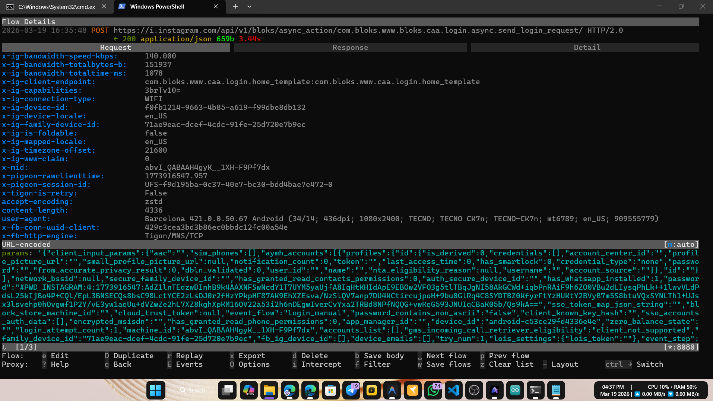
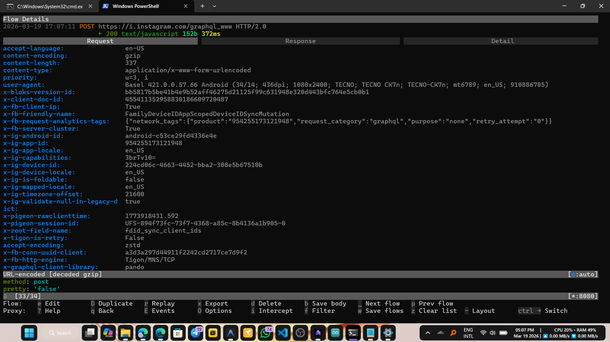

# 🔐 Threads-SSL-Pinning-Bypass
📡 Intercept Threads network traffic on Android device

## 📌 Latest Bypassed and Tested App Details
- Threads version: **421.0.0.50.67**
- Edits version: **421.0.0.57.66**
- Architecture: **arm64-v8a, x86_64**
- Tools Used for test: [Mitmproxy](https://mitmproxy.org/), [Burp Suite](https://portswigger.net/burp), [HTTP Toolkit](https://httptoolkit.com/), [Reqable](https://reqable.com/).
- For any inquiries, please contact me on Telegram [https://t.me/DarknessKing999](https://t.me/DarknessKing999)

## 🎥 Evidence
- **Threads:**


- **Edits:**


## ✅ Other Apps
1. [Threads iOS](https://github.com/shajon-dev/iOS-Threads-SSL-Pinning-Bypass)
2. [Facebook Android](https://github.com/shajon-dev/Facebook-SSL-Pinning-Bypass)
3. [Facebook iOS](https://github.com/shajon-dev/iOS-Facebook-SSL-Pinning-Bypass)
4. [Messenger Android](https://github.com/shajon-dev/Messenger-SSL-Pinning-Bypass)
5. [Messenger iOS](https://github.com/shajon-dev/iOS-Messenger-SSL-Pinning-Bypass)
6. [Instagram Android](https://github.com/shajon-dev/Instagram-SSL-Pinning-Bypass)
7. [Instagram iOS](https://github.com/shajon-dev/iOS-Instagram-SSL-Pinning-Bypass)
8. [Business Suite Android](https://github.com/shajon-dev/Meta-Business-Suit-SSL-Pinning-Bypass)

## 📦 For Demo - Download Official APKs
  - For any issues, contact me on Telegram. Read README.md carefully before use.
  - Latest version is not free.
<table width="100%">
  <thead>
    <tr>
      <th rowspan="2" align="center">Package Name</th>
      <th rowspan="2" align="center">Version</th>
      <th rowspan="2" align="center">Status</th>
      <th colspan="2" align="center">Download Link</th>
    </tr>
    <tr>
      <th align="center">arm64-v8a</th>
      <th align="center">x86_64</th>
    </tr>
  </thead>
  <tbody>
    <tr>
      <td rowspan="2" align="center"><code>com.instagram.barcelona</code></td>
      <td align="center">421.0.0.50.67</td>
      <td align="center">✅ Bypassed</td>
      <td colspan="2" align="center"><a href="https://t.me/DarknessKing999">Contact Telegram</a></td>
    </tr>
    <tr>
      <td align="center">390.0.0.40.81</td>
      <td align="center">✅ Bypassed</td>
      <td align="center"><a href="https://www.apkmirror.com/apk/instagram/threads-an-instagram-app/threads-390-0-0-40-81-release/threads-390-0-0-40-81-7-android-apk-download/">Download Link</a></td>
      <td align="center"><a href="https://www.apkmirror.com/apk/instagram/threads-an-instagram-app/threads-390-0-0-40-81-release/threads-390-0-0-40-81-8-android-apk-download/">Download Link</a></td>
    </tr>
  </tbody>
</table>

**📂 Free Patched `libstartup.so` files are available in the `libs/` folder**
**📜 Consolidated login scripts are available in the `login.sh` file**

## ☕ Donation

If this project helped you, consider buying me a coffee! ❤️

| Coin | Network | Address |
| :--- | :--- | :--- |
| <table border="0" cellpadding="0" cellspacing="0"><tr><td></td><td>&nbsp;<b>USDT</b></td></tr></table> | TRC20 [TRX Network] | `TAsPdCxkX9CeErJ4vw7xBHfZDT6vpdfmwH` |
| <table border="0" cellpadding="0" cellspacing="0"><tr><td></td><td>&nbsp;<b>ANY Crypto</b></td></tr></table> | ETH / BSC | `0x22d4f314acbf6055b0a37df8df68f9cd40ba889a` |
| <table border="0" cellpadding="0" cellspacing="0"><tr><td></td><td>&nbsp;<b>BTC</b></td></tr></table> | Bitcoin Network | `14RYf4pw7v2rtttLxRch2StjFzFAn9ycCE` |

## 📱 Requirements
1. 🔓 Rooted Android phone or Emulator with root access (LDPlayer 9 / Nox Player)
2. 🛠️ ADB tools required for real devices only. Or use [MT Manager](https://mt2.cn/) to replace the .so file on the device.
3. 🔄 Tools for traffic capture: [Mitmproxy](https://mitmproxy.org/), [Burp Suite](https://portswigger.net/burp), [HTTP Toolkit](https://httptoolkit.com/), [Reqable](https://reqable.com/).

## 🔧 Setup Process
 1. 🔧 **Replace patched `libstartup.so`** with the original file at: `/data/data/com.instagram.barcelona/lib-compressed/libstartup.so`
 2. 📲 **Use ADB command** to push the patched library:
    ```
    adb push [YOUR_libstartup.so_PATH] /data/data/com.instagram.barcelona/lib-compressed/libstartup.so
    ```
 4. Use any packet capture tool to monitor Threads network traffic.

## Looking for leatest version patched `libstartup.so`? Contact me on Telegram
<p align="left">
  <a href="https://t.me/DarknessKing999" target="_blank">
    
  </a>
</p>
