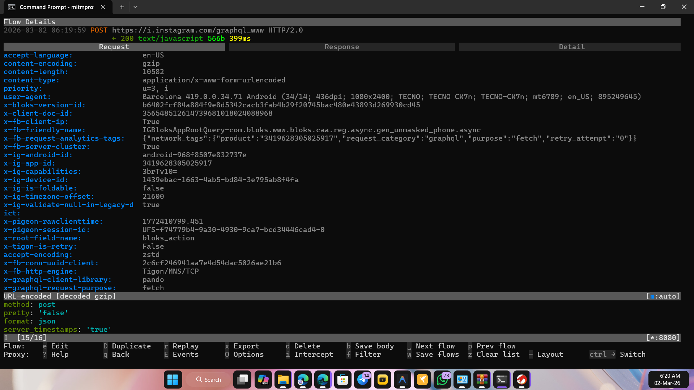
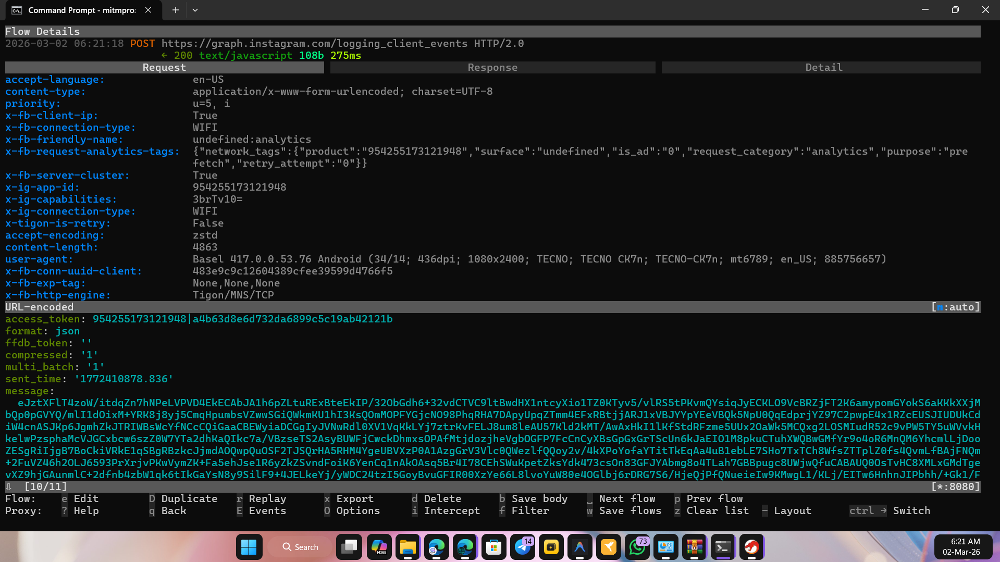

# 🔐 Threads-SSL-Pinning-Bypass
📡 Intercept Threads network traffic on Android device

## 📌 Latest Bypass & Tested App Version
- 🎯 Threads version: **419.0.0.34.71**
- 🎯 Edits version: **417.0.0.53.76**
- Architecture: **arm64-v8a**
- For any inquiries, please contact me on Telegram [https://t.me/DarknessKing999](https://t.me/DarknessKing999)

## 🎥 Evidence
- **Threads:**

- **Edits:**

## ✅ Other Apps
1. [Threads iOS](https://github.com/shajon-dev/iOS-Threads-SSL-Pinning-Bypass)
2. [Facebook Android](https://github.com/shajon-dev/Facebook-SSL-Pinning-Bypass)
3. [Facebook iOS](https://github.com/shajon-dev/iOS-Facebook-SSL-Pinning-Bypass)
4. [Messenger Android](https://github.com/shajon-dev/Messenger-SSL-Pinning-Bypass)
5. [Messenger iOS](https://github.com/shajon-dev/iOS-Messenger-SSL-Pinning-Bypass)
6. [Instagram Android](https://github.com/shajon-dev/Instagram-SSL-Pinning-Bypass)
7. [Instagram iOS](https://github.com/shajon-dev/iOS-Instagram-SSL-Pinning-Bypass)
8. [Business Suite Android](https://github.com/shajon-dev/Meta-Business-Suit-SSL-Pinning-Bypass)

## 📱 Requirements
1. 🔓 Rooted or Rootless Android phone/tablet (no need root access)
2. 🔄 ProxyPin or Reqable App for traffic capture

## 🎶 Setup Process
- Install Modified APK & run traffic capture tool

**📂 Free Patched `libcoldstart.so` files are available in the `libs/` folder**

## Looking for leatest version modified apk? Contact me on Telegram

  

---

## 📜 License

This project is licensed under the  
**Creative Commons Attribution-NonCommercial 4.0 International (CC BY-NC 4.0)** License.

You are free to:
- Share — copy and redistribute the material
- Adapt — remix, transform, and build upon the material

Under the following terms:
- Attribution — You must give appropriate credit to the original author (S. SHAJON).
- NonCommercial — You may not use this project for commercial or professional purposes.

⚠ Commercial or professional use requires prior written permission from the author.

🔗 Full License: https://creativecommons.org/licenses/by-nc/4.0/
